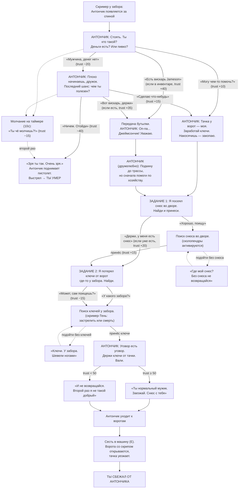

# Антончик — диаграмма диалогов и квеста

Внутреннее состояние: **trust** (доверие), стартует с 30.
Антончик стреляет, если trust падает до 0, если ему нагрубить дважды,
или если дважды промолчать на таймере выбора (10 секунд).

## Прочие смерти

| Причина | Экран |
|---|---|
| Trust ≤ 0 в любой момент диалога | «Не надо было злить Антончика.» |
| Дважды промолчать на выборе | «Не надо было злить Антончика.» |
| Тень (скример) добежала до игрока | «Тень добралась до тебя. Надо было стрелять.» |

## Задания (HUD в стиле GTA V, низ экрана)

1. «Найди способ **выбраться со двора**» — до встречи у забора
2. «Найди **снюс** во дворе и принеси Антончику»
3. «Найди **ключи от ворот** у забора»
4. «Сядь в **машину** и уезжай»
